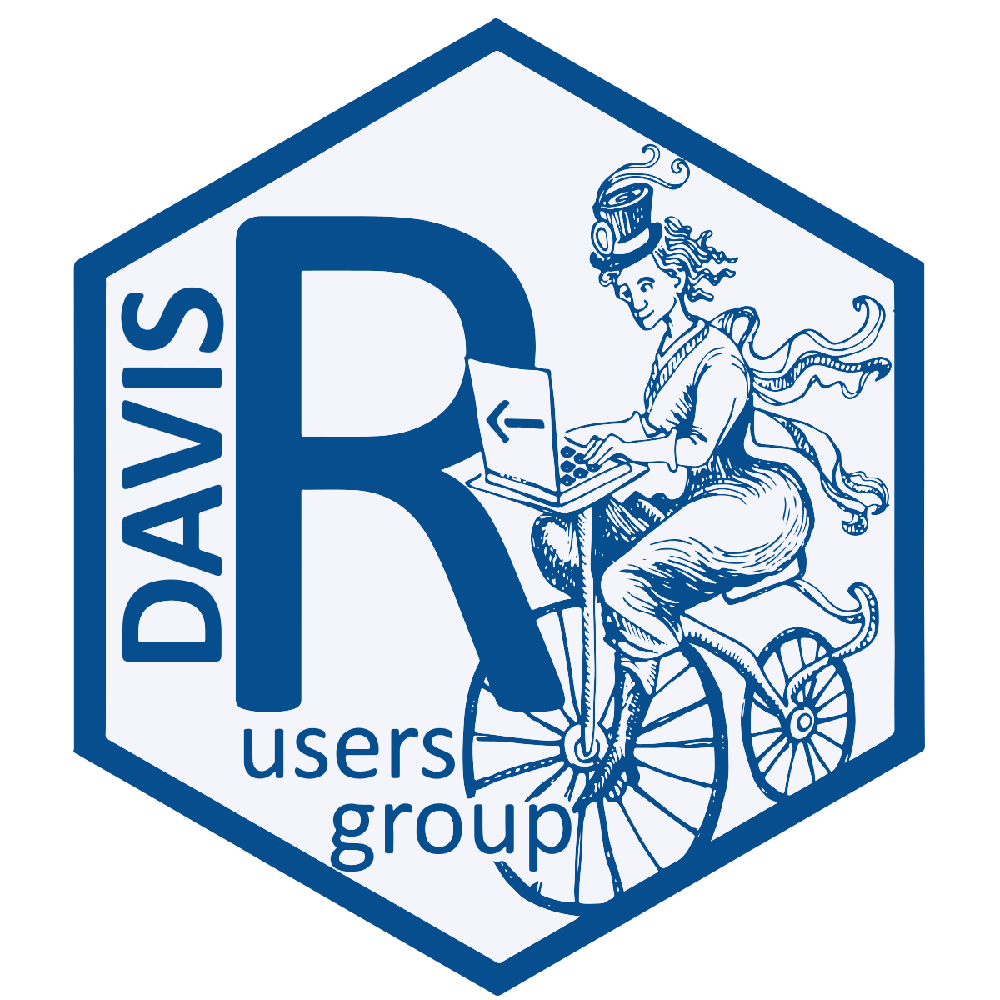
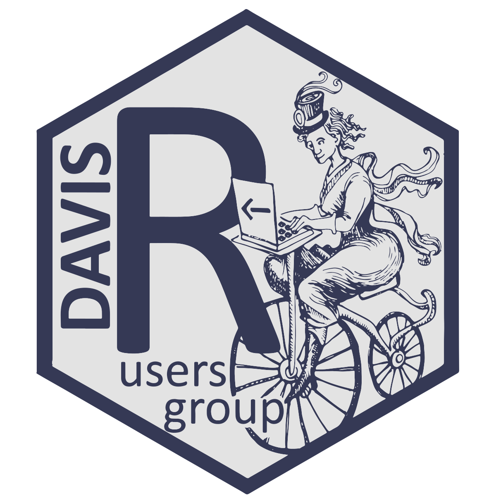

# Logos and Stickers for Davis R Users Group

This repo contains files for the [Davis R Users Group](http://www.noamross.net/davis-r-users-group.html) logo and stickers, created by [Allison Simler](http://ucanr.edu/sites/rizzolab/People/Allison_Simler/).

`*.ai` and `*.psd` are for Adobe Illustrator and Photoshop, respectively.  They can be opened with Inkscape and GIMP.

 This work is licensed under a <a rel="license" href="http://creativecommons.org/licenses/by/4.0/">Creative Commons Attribution 4.0 International License</a>.  The copyright holder is the Davis R Users Group, but we'd be happy if you gave a shout-out (or a commission 😀) to our designer, [Allison Simler](http://ucanr.edu/sites/rizzolab/People/Allison_Simler/).
